# Multi-cloud Kubernetes + SQL Server lab — AKS, EKS, GKE

Three parallel labs, one POC repeated on Azure, AWS, and Google Cloud,
each meeting the same five requirements with each cloud's native
primitives:

1. Deploy a sample .NET 8 app to a managed Kubernetes cluster, in a `dev` namespace
2. Store and rotate the database password in the cloud's native secret store
3. Connect the app to a managed SQL Server instance over a private network path only
4. Restrict pod-to-pod ping to the `dev` namespace via NetworkPolicy
5. Expose the app externally via the cloud's native ingress/load balancer

| | AKS | EKS | GKE |
|---|---|---|---|
| Setup guide | [`aks-lab/README.md`](aks-lab/README.md) | [`eks-lab/README.md`](eks-lab/README.md) | [`gke-lab/README.md`](gke-lab/README.md) |
| Status | ✅ all 5 requirements verified | ✅ all 5 requirements verified (after a real incident — see its README) | ✅ all 5 requirements verified, cleanest run of the three |

## Resource creation and connection flow, side by side

This shows the order resources get created in, and how they connect,
across all three clouds. Read top to bottom within a column; read across
a row to compare the same step on each cloud.

```mermaid
flowchart TB
    subgraph AKS["AKS (Azure)"]
        A1["1. VNet + subnets"]
        A2["2. AKS cluster<br/>Azure CNI"]
        A3["3. Azure SQL<br/>+ private endpoint resource"]
        A4["4. Key Vault<br/>2 separate secrets"]
        A5["5. Workload Identity<br/>Managed Identity to SA"]
        A6["6. CSI driver<br/>Azure provider"]
        A7["7. Pod env vars<br/>synced K8s Secret"]
        A8["8. App connects<br/>plain TCP/SQL"]
        A1-->A2-->A3-->A4-->A5-->A6-->A7-->A8
    end

    subgraph EKS["EKS (AWS)"]
        E1["1. VPC + subnets<br/>via eksctl"]
        E2["2. EKS cluster<br/>VPC CNI, OIDC enabled"]
        E3["3. RDS SQL Server<br/>private subnet + security group"]
        E4["4. Secrets Manager<br/>1 combined JSON secret"]
        E5["5. IRSA<br/>IAM role to SA via OIDC"]
        E6["6. CSI driver<br/>AWS provider"]
        E7["7. Pod env vars<br/>synced K8s Secret"]
        E8["8. App connects<br/>plain TCP/SQL"]
        E1-->E2-->E3-->E4-->E5-->E6-->E7-->E8
    end

    subgraph GKE["GKE (GCP)"]
        G1["1. VPC + subnet<br/>+ PSA range"]
        G2["2. GKE cluster<br/>Dataplane V2 + Workload Identity at creation"]
        G3["3. Cloud SQL<br/>private IP via PSA peering"]
        G4["4. Secret Manager<br/>5 separate secrets"]
        G5["5. Workload Identity Federation<br/>GSA to KSA"]
        G6["6. CSI driver<br/>GCP provider"]
        G7["7. Pod env vars<br/>synced K8s Secret"]
        G8["8. App connects<br/>plain TCP/SQL"]
        G1-->G2-->G3-->G4-->G5-->G6-->G7-->G8
    end
```



### What stays the same across all three clouds

Step 8 is identical everywhere: the app opens a normal SQL connection
over the network. Nothing Kubernetes-specific or cloud-specific touches
that connection itself — it's the same ADO.NET code path regardless of
which cluster it's running on. Kubernetes and the CSI driver are only
involved in getting the *credentials* into the pod safely; they are not
in the data path of the actual database connection.

### What genuinely differs

- **Secret shape.** Azure and GCP split the credential into separate
  named secrets per field (username, password, host, port, dbname).
  AWS combines all fields into one JSON blob and relies on the AWS CSI
  provider's `jmesPath` feature to split it back out at mount time — the
  GCP provider has no equivalent splitting feature, which is why the GKE
  lab uses 5 separate secrets rather than copying the EKS pattern.
- **Private database access mechanism.** Three genuinely different
  primitives, not the same thing under different names:
  - Azure: a dedicated **Private Endpoint** resource, with its own
    private DNS zone resolving the server's public-looking FQDN to a
    private IP.
  - AWS: no dedicated "endpoint" resource at all — just a private
    subnet, no public IP on the RDS instance, and a security group
    restricting inbound traffic to the EKS node security group.
  - GCP: **Private Service Access** — a dedicated IP range is allocated
    and peered to Google's service-producer network; Cloud SQL draws its
    private IP from that peered range.
- **NetworkPolicy enforcement timing — the one that mattered most in
  practice.** AKS gets it via a single `--network-policy azure` flag at
  cluster creation. GKE gets it via `--enable-dataplane-v2`, also at
  cluster creation — enforcement is built into the data path from the
  cluster's first moment. EKS has no such flag; NetworkPolicy enforcement
  (Calico, or VPC CNI's native mode) has to be installed as a separate
  step *after* the cluster and its default networking are already
  running. That structural difference is exactly what caused a real,
  severe, cluster-wide outage during the EKS lab's testing — full
  details, root-cause investigation, and the eventual safe retest
  procedure are in [`eks-lab/README.md`](eks-lab/README.md). The GKE lab
  hit zero equivalent incidents, which is consistent with — though
  doesn't on its own prove — the theory that "built in at creation" is
  structurally safer than "retrofitted onto a live cluster."

## Where to start

Each lab is self-contained — its own `install-tools.sh`, `run-all.sh`,
and `cleanup.sh`. Pick the cloud you want and follow that lab's README
from there:

```bash
cd aks-lab/    # or eks-lab/, or gke-lab/
cat README.md
```
