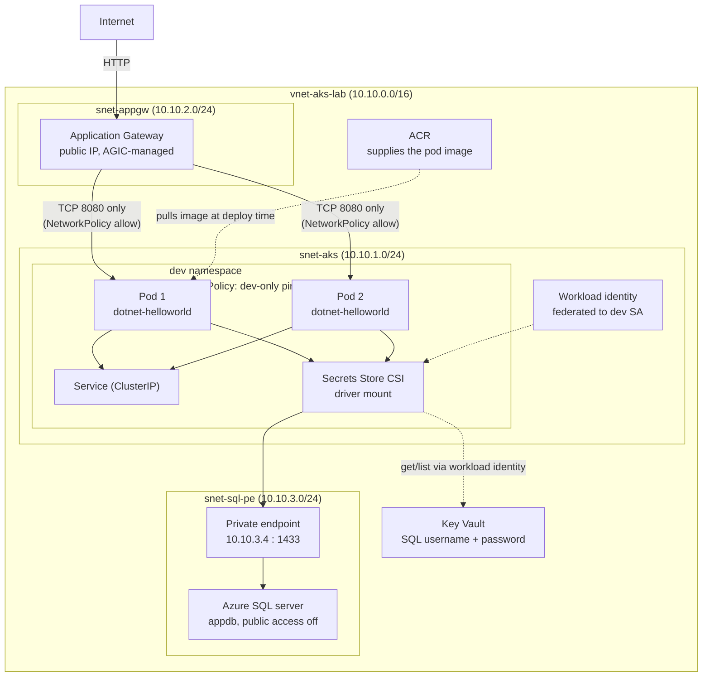

# AKS + Azure SQL Lab — Setup Guide

## What this covers
1. Dockerfile for `mridulsingh8390/dotnet8` (HelloWorldApp.web)
2. AKS cluster, VNet, private endpoint to Azure SQL, ACR, Key Vault, AGIC — all via `00-azure-infra.sh`
3. Deployment to the `dev` namespace, pulling DB password from Key Vault via the CSI driver
4. NetworkPolicy restricting ping/traffic to the `dev` namespace only — **while still allowing AGIC through** (see the dedicated section below; this is the single most important thing to understand before you debug anything)
5. AGIC Ingress to expose the app externally
6. A password rotation script for Key Vault

This README reflects the actual setup that was run end-to-end and
verified — including the real issues hit along the way and the fixes
already built into the scripts, not just the original plan. If you follow
the steps below in order, you should not need to rediscover any of this.

## Architecture — what's actually deployed

This is the resource topology once `run-all.sh` finishes, not the order
the scripts execute in. Solid arrows are network traffic; the dashed arrow
is the secret-read path via the workload identity, which is a control-plane
call, not application traffic.



## A note on the Dockerfile
GitHub blocked this tool from browsing past the repo root, so the
solution layout (`HelloWorldApp.sln` + `HelloWorldApp.web/` folder, with a
language mix of HTML/C#/CSS/JS indicating an ASP.NET Core Razor/MVC app)
was visible, but not the actual `.csproj` filename or `Program.cs`. This
was later confirmed directly: the project file is `HelloWorldApp.web.csproj`,
SDK `Microsoft.NET.Sdk.Web`, target framework `net8.0`, and no
`<AssemblyName>` override — meaning the Dockerfile's `ENTRYPOINT ["dotnet",
"HelloWorldApp.web.dll"]` is confirmed correct as-is, not just assumed.
No changes needed here unless you've forked the source repo and renamed
the project.

## Quickest path: one script

```bash
chmod +x run-all.sh
./run-all.sh
```

This chains everything below: infra → identity federation → placeholder
substitution → image build/push → `kubectl apply`. Expect ~30-40 minutes
total in the common case, mostly waiting on AKS/SQL/App Gateway
provisioning — though see "Things that went wrong during the real run"
below, since a couple of these can add real time if you hit them.

Read through `00-azure-infra.sh` once before running — it creates real
billable Azure resources. It does not delete anything on its own.

### If anything fails partway through

The most likely partial-failure scenario isn't a code bug — it's
re-running on top of a resource group that still has resources in it from
a previous, incomplete attempt. `00-azure-infra.sh` now detects this and
warns you with a list of what's already there, asking you to confirm
before continuing. The safe answer in almost all cases is to decline,
fully delete the resource group, wait for the deletion to complete, and
re-run from scratch:

```bash
az group delete -n rg-aks-lab --yes
# wait for this to return — don't background it with --no-wait when
# you're about to immediately re-run, or the next run can race the
# deletion and hit confusing subnet-in-use errors
az group exists -n rg-aks-lab   # must return false before re-running
./run-all.sh
```

## Things that went wrong during the real run, and what's already fixed

These are documented here deliberately, because every one of them looked
like a different problem until investigated, and the scripts now handle
or avoid each one. You shouldn't need to debug these again, but it's worth
knowing what's already accounted for.

**Azure SQL region capacity restrictions.** The first two attempts, in
`eastus` and then `eastus2`, both failed with `RegionDoesNotAllowProvisioning`
for the SQL server specifically — a subscription-level restriction common
on pay-as-you-go/free-tier subscriptions, not a bug in the script.
`centralindia` worked and is now the script's default `LOCATION`. If you
hit this again on a different subscription, the fix is the same: try a
different region (a non-US region is more likely to sidestep a US-wide
restriction), or check `aka.ms/sqlcapacity` / request a quota increase via
Azure support if every region fails.

**Resource propagation races.** A handful of `az` commands return success
slightly before the resource is reliably queryable by the very next
command that depends on it — this caused a real `ResourceNotFound` error
on a SQL server that, seconds later, queried fine. `00-azure-infra.sh`
now has a `wait_for_resource` polling function used after VNet, Key Vault,
SQL server, private endpoint, and Application Gateway creation, closing
this race before the next dependent command runs.

**The SQL private endpoint's IP not showing up via CLI.** The
`customDnsConfigs` field on `az network private-endpoint show` came back
empty even though the IP was correctly assigned at the NIC level — a
CLI/API quirk, not a real provisioning failure. If you ever hit this,
the Azure Portal's Private Endpoint → DNS configuration page shows the
real IP reliably; the NIC's IP configuration page is the other reliable
source (`az network nic show --query "ipConfigurations[0].privateIPAddress"`
using the NIC ID from the private endpoint's `networkInterfaces[0].id`).

**The NetworkPolicy silently blocking AGIC — read this one carefully.**
This is the one worth understanding, not just trusting is fixed, because
the same shape of bug is easy to reintroduce if you ever edit the
NetworkPolicy later.

A NetworkPolicy that allows ingress only from pods in a namespace labeled
`environment: dev` does exactly what it says — and Application Gateway's
health-probe and proxied traffic, arriving from its own dedicated subnet
(`snet-appgw`), is genuinely external to `dev` from that policy's point of
view. So with only the dev-only rule in place, AGIC's backend health
reports `Unhealthy` with a generic-looking timeout message, while
everything else about the deployment — the pod, the app, DNS, IP
forwarding, node routing, NSGs, AGIC's own generated config — checks out
completely clean. It looks like an infrastructure problem. It isn't one.

The giveaway, if you ever see this again: a completely separate `Service`
of `type: LoadBalancer` pointed at the same pods works fine, because
Azure's native load balancer path isn't subject to the same NetworkPolicy
match the way genuinely external, different-subnet traffic is. A working
LoadBalancer test does NOT rule out a NetworkPolicy cause for AGIC
specifically — they're different traffic paths even though both look
"external to the namespace."

`05-networkpolicy.yaml` already includes the fix: a second ingress rule
explicitly allowing traffic from the App Gateway subnet (`10.10.2.0/24`)
on TCP port 8080 only — not a blanket allow, so ICMP and every other port
from that subnet are still blocked. The original dev-only ping restriction
is fully intact alongside it. If you ever modify this file, keep both
rules; removing the AppGW rule to "simplify" it will silently break AGIC
again with the exact same confusing symptom.

## Apply order (manual, if not using run-all.sh)

### 1. Azure infrastructure
```bash
chmod +x 00-azure-infra.sh
./00-azure-infra.sh
```
This prints out the values you need for the placeholders below, and also
writes them to `.infra-state.env` for `run-all.sh`/`cleanup.sh` to read
automatically. If the script detects leftover resources from a previous
run in `rg-aks-lab`, it will list them and ask you to confirm before
continuing — see "If anything fails partway through" above.

### 2. Build and push the image
```bash
chmod +x build-and-push.sh
# edit ACR_NAME in build-and-push.sh first
./build-and-push.sh
```

### 3. Set up workload identity federation (required for CSI driver auth)
`run-all.sh` does this automatically: creates the `id-dotnet-app` managed
identity, enables the OIDC issuer/workload identity feature on the
cluster if needed, federates the identity to
`system:serviceaccount:dev:dotnet-app-sa`, grants it `get`/`list` on Key
Vault secrets, and stores the `sql-admin-username` secret (the infra
script only stores `sql-admin-password` on its own). The manual equivalent
commands are documented in the comment block at the top of
`01-serviceaccount.yaml` if you're doing this by hand instead.

### 4. Fill in placeholders
Search every file under `k8s/dev/` for `<...>` placeholders and replace with
the values printed by step 1 and the identity created in step 3
(`run-all.sh` does this with `sed` automatically):

| Placeholder | Where | Source |
|---|---|---|
| `<USER-ASSIGNED-IDENTITY-CLIENT-ID>` | 01, 02 | `az identity show --query clientId` |
| `<KEY-VAULT-NAME>` | 02 | infra script output / `.infra-state.env` |
| `<AZURE-TENANT-ID>` | 02 | `az account show --query tenantId` |
| `<SQL_SERVER_NAME>` | 03 | infra script output / `.infra-state.env` |
| `<SQL-PRIVATE-ENDPOINT-IP>` | 03 | infra script output / `.infra-state.env`, or the Portal if the CLI field comes back empty (see above) |
| `<ACR_NAME>` | 04 | infra script output / `.infra-state.env` |

### 5. Apply the manifests
```bash
kubectl apply -f k8s/dev/00-namespace.yaml
kubectl apply -f k8s/dev/01-serviceaccount.yaml
kubectl apply -f k8s/dev/02-secretproviderclass.yaml
kubectl apply -f k8s/dev/03-configmap.yaml
kubectl apply -f k8s/dev/04-deployment-service.yaml
kubectl apply -f k8s/dev/05-networkpolicy.yaml
kubectl apply -f k8s/dev/07-ingress-agic.yaml
```

### 6. Verify DB connectivity
```bash
kubectl get pods -n dev
kubectl logs -n dev deploy/dotnet-helloworld
kubectl exec -n dev deploy/dotnet-helloworld -- env | grep SQL_
```
The logs alone won't confirm a real SQL connection unless the app's
default route actually queries the database — a plain ASP.NET Core
welcome page typically doesn't. For a definitive, code-independent check,
open a raw TCP connection to the SQL endpoint from inside a pod:
```bash
kubectl run nettest --rm -it --restart=Never -n dev --image=busybox -- \
  nc -zv <sql-server-name>.database.windows.net 1433
```
A response like `... (10.10.3.x:1433) open` confirms both private DNS
resolution and actual port reachability over the private link.

### 7. Verify ping/NetworkPolicy behavior
```bash
kubectl apply -f k8s/dev/06-network-test-pods.yaml

DEV_IP=$(kubectl get pod -n dev net-test-dev -o jsonpath='{.status.podIP}')

# From a pod inside dev -> should succeed
kubectl exec -n dev net-test-dev -- ping -c 3 "$DEV_IP"

# From a pod outside dev -> should time out / fail
kubectl exec -n other-ns net-test-other -- ping -c 3 "$DEV_IP"
```
If the pod's IP doesn't show up immediately after `kubectl apply`, that's
just normal pod-scheduling lag — re-run `kubectl get pod -n dev net-test-dev
-o wide` a few seconds later rather than assuming something's wrong.

### 8. Verify AGIC / external access
```bash
kubectl get ingress -n dev
curl -v http://<ADDRESS-from-above>/
```
If this returns `502 Bad Gateway`, check backend health before anything
else:
```bash
az network application-gateway show-backend-health -g rg-aks-lab -n appgw-aks-lab -o json
```
If it reports `Unhealthy` with a probe-timeout message, but the pod
responds fine to direct in-cluster requests (see step 6's `nc` test, or a
similar `wget`/`curl` test against the pod IP directly) — re-read the
NetworkPolicy section above before changing anything else. This was the
actual cause the one time it happened during real testing, and the
05-networkpolicy.yaml file already includes the fix; if you've modified
that file, this is the first thing to check.

### 9. Rotate the SQL password later
```bash
chmod +x rotate-sql-password.sh
./rotate-sql-password.sh
```
(`run-all.sh` already fills in this script's placeholders; no manual
editing needed if you used it.)

## Why the app connects via private IP/FQDN
The infra script disables public network access on the SQL logical server
and creates a Private Endpoint inside `snet-sql-pe`, linked to a Private DNS
zone (`privatelink.database.windows.net`) that's attached to the VNet. Any
pod in AKS (which uses Azure CNI and lives in the same VNet) resolving
`<server>.database.windows.net` will get back the private IP automatically —
no public internet path is used. The ConfigMap exposes both the FQDN
(recommended) and the literal private IP in case your app config needs the
raw IP specifically.

## Tearing everything down

```bash
chmod +x cleanup.sh
./cleanup.sh
```

This deletes the entire resource group in one shot (AKS, VNet, ACR, Key
Vault, SQL server/database, private endpoint, App Gateway, public IP,
private DNS zone, the workload identity — everything created by
`00-azure-infra.sh`/`run-all.sh` lives inside it). It asks you to type the
resource group name to confirm before deleting anything; pass
`./cleanup.sh --yes` to skip that prompt. Deletion runs in the background
(`--no-wait`) and typically takes 15-20+ minutes to fully complete — App
Gateway and the SQL private endpoint are usually the slowest pieces.
Check progress with:
```bash
az group exists -n rg-aks-lab
```
This is genuinely destructive — it removes the SQL database and any data
in it along with everything else. There's no undo.

If you also created the temporary `LoadBalancer` Service while debugging
(`kubectl expose deployment ... --type=LoadBalancer`), delete it
separately before or after cleanup — it isn't tracked by `cleanup.sh`
since it isn't part of the core manifest set:
```bash
kubectl delete svc dotnet-helloworld-lb -n dev
```
