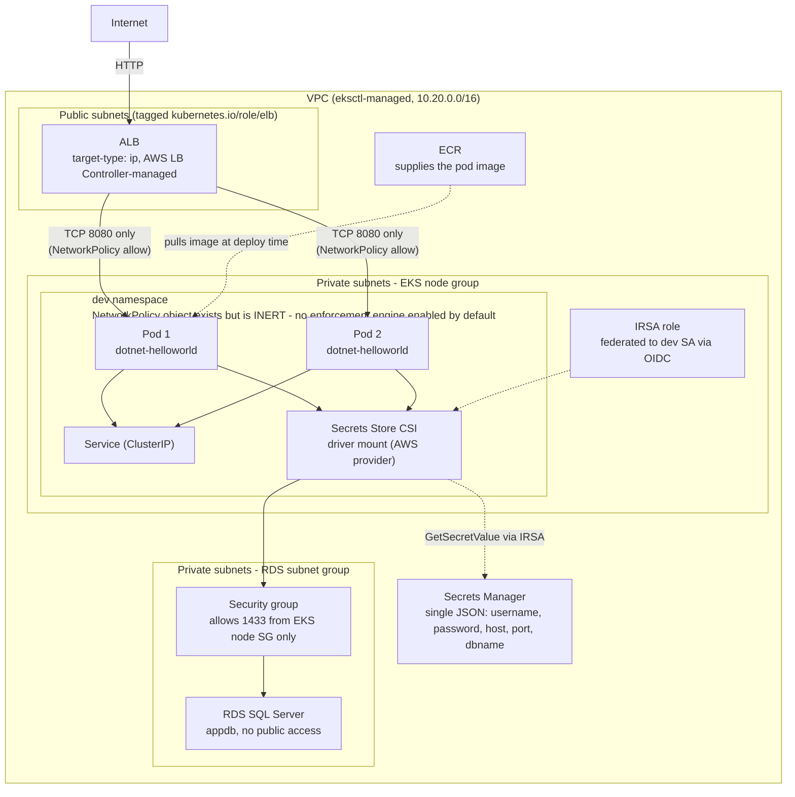

# EKS + RDS SQL Server Lab — Setup Guide

This is the AWS/EKS equivalent of the AKS lab, covering the same six
requirements with AWS-native primitives:

| AKS lab | EKS lab |
|---|---|
| AKS | EKS (provisioned via `eksctl`) |
| ACR | ECR |
| Azure Key Vault | AWS Secrets Manager |
| Azure SQL + Private Endpoint | RDS SQL Server, private subnet, security-group-restricted |
| Azure AD Workload Identity | IRSA (IAM Roles for Service Accounts) |
| `--network-policy azure` (built-in) | **Disabled by default, opt-in** — both options broke this cluster once, then worked cleanly on a retest with fresh nodes; see warning section below before enabling |
| AGIC (Application Gateway Ingress Controller) | AWS Load Balancer Controller + ALB Ingress |

## Architecture — what's actually deployed

This is the resource topology once `run-all.sh` finishes, not the order
the scripts execute in. Solid arrows are network traffic; the dashed arrow
is the secret-read path via IRSA, which is a control-plane call, not
application traffic.



## Quickest path: one script

```bash
chmod +x run-all.sh
./run-all.sh
```

Expect ~35-45 minutes total — RDS provisioning alone typically takes
10-15 minutes, and the EKS cluster itself another 10-15. The script pauses
once partway through and asks you to manually create the application
database (see below) before continuing, since RDS has no API equivalent
to Azure SQL's `az sql db create` for SQL Server engines.

If you'd rather run things manually instead, the sections below describe
what `run-all.sh` does step by step.

## Prerequisites

Run `install-tools.sh` first if you don't already have `aws`, `eksctl`,
`kubectl`, `helm`, `jq`, and `docker` installed:

```bash
chmod +x install-tools.sh
./install-tools.sh
# log out and back in (or: newgrp docker)
aws configure   # set access key, secret key, default region
```

## Apply order (manual, if not using run-all.sh)

### 1. AWS infrastructure
```bash
./00-aws-infra.sh
```
Creates the EKS cluster (via `eksctl`, which also provisions the VPC,
subnets, and NAT gateway), ECR repo, RDS SQL Server instance in a private
subnet, a security group restricting RDS access to the EKS node security
group only, and the initial Secrets Manager secret.

### 2. Create the application database
RDS gives you a SQL Server *instance*, but not a named database inside
it — that's a SQL-level operation, not an AWS API call. Once
`00-aws-infra.sh` finishes, get the password and connect:
```bash
aws secretsmanager get-secret-value --secret-id eks-lab/sql-credentials \
  --region <region> --query SecretString --output text | jq -r .password
```
Then, from a pod inside the cluster (so it can actually reach the private
RDS endpoint):
```bash
kubectl run sqlcmd-tmp --rm -it --restart=Never -n default \
  --image=mcr.microsoft.com/mssql-tools -- \
  /opt/mssql-tools/bin/sqlcmd -S <rds-endpoint> -U sqladmin -P '<password>' \
  -Q "CREATE DATABASE appdb;"
```

### 3. IRSA, Secrets Store CSI driver, ALB controller
```bash
./01-aws-lbc-and-identity.sh
```
This is the step with no single-flag AKS equivalent — on AKS,
`--enable-addons azure-keyvault-secrets-provider` did this in one command.
On EKS it's three separate installs: an IAM role (IRSA) for the pod, the
Secrets Store CSI driver + AWS provider (Helm), and the AWS Load Balancer
Controller (Helm). NetworkPolicy enforcement (Calico or VPC CNI native
mode) is intentionally **not** installed by this step anymore — see
"NetworkPolicy enforcement is currently disabled by default" further down
before considering either option.

### 4. Fill in placeholders
| Placeholder | Where | Source |
|---|---|---|
| `<POD-IAM-ROLE-ARN>` | 01 | printed by `01-aws-lbc-and-identity.sh` / `.infra-state.env` |
| `<SQL-SECRET-ARN>` | 02 | `.infra-state.env` (`SECRET_ARN`) |
| `<ECR_URI>` | 04, build-and-push.sh | `.infra-state.env` |
| `<AWS_REGION>` | build-and-push.sh | `.infra-state.env` |
| `<ALB-SUBNET-CIDRS>` | 05 | see note below — **not auto-fillable with a correct value until after the ALB exists** |

`run-all.sh` auto-fills everything except the NetworkPolicy's ALB CIDR,
which it defaults to the full VPC CIDR as a safe starting point (broader
than ideal, but functionally correct) and prints instructions to narrow
afterward — see "What the NetworkPolicy YAML still accounts for" further
down for why this matters. Note that the NetworkPolicy object itself is
currently inert regardless, since no enforcement engine is enabled by
default (see the dedicated warning section below).

### 5. Build, push, apply
```bash
./build-and-push.sh
kubectl apply -f k8s/dev/00-namespace.yaml
kubectl apply -f k8s/dev/01-serviceaccount.yaml
kubectl apply -f k8s/dev/02-secretproviderclass.yaml
kubectl apply -f k8s/dev/03-configmap.yaml
kubectl apply -f k8s/dev/04-deployment-service.yaml
kubectl apply -f k8s/dev/05-networkpolicy.yaml
kubectl apply -f k8s/dev/07-ingress-alb.yaml
```

### 6. Verify DB connectivity
```bash
kubectl get pods -n dev
kubectl logs -n dev deploy/dotnet-helloworld
kubectl exec -n dev deploy/dotnet-helloworld -- env | grep SQL_
```

### 7. Verify ping/NetworkPolicy behavior
```bash
kubectl apply -f k8s/dev/06-network-test-pods.yaml
DEV_IP=$(kubectl get pod -n dev net-test-dev -o jsonpath='{.status.podIP}')
kubectl exec -n dev net-test-dev -- ping -c 3 "$DEV_IP"        # should succeed
kubectl exec -n other-ns net-test-other -- ping -c 3 "$DEV_IP" # see note below
```
NetworkPolicy enforcement is **not enabled by default** (see the
dedicated section further down) — with it off, the second command will
also succeed, since nothing is restricting cross-namespace traffic yet.
That's expected and not a failure of anything; it just means enforcement
hasn't been turned on. Once you deliberately enable it (same section
below has the exact steps and the safety checks to run immediately
after), this second command should show `100% packet loss` instead —
confirmed working this way on a retest with freshly-replaced nodes.

### 8. Verify ALB ingress
```bash
kubectl get ingress -n dev   # wait a few minutes for ADDRESS to populate
curl -v http://<ADDRESS-from-above>/
```

### 9. Rotate the SQL password later
```bash
./rotate-sql-password.sh
```

## NetworkPolicy enforcement — incident, then a successful retest

This is the most important thing to understand before touching anything
related to NetworkPolicy on this lab.

During initial end-to-end testing, **both** of the two standard options
for enforcing NetworkPolicy on EKS caused severe, reproducible,
cluster-wide outages on this account/cluster combination:

- **Calico** (Tigera operator, policy-only mode on top of VPC CNI) — the
  AKS-parity choice this lab originally defaulted to.
- **VPC CNI's own native NetworkPolicy mode** (`enableNetworkPolicy: "true"`
  on the `vpc-cni` addon) — tried as the simpler, AWS-native alternative
  after Calico failed.

Both produced the same symptom: pod-to-pod connectivity loss and CoreDNS
unable to reach the Kubernetes API server's ClusterIP
(`dial tcp 172.20.0.1:443: i/o timeout`), affecting every pod on the
affected node — not just NetworkPolicy-governed traffic. The breakage did
**not** self-resolve when the feature was disabled again afterward; it
only cleared once the affected EC2 instances were terminated and the node
group replaced them with fresh ones.

Every individual infrastructure layer was checked directly and came back
clean: IAM permissions (including manually testing `ec2:CreateNetworkInterface`
and `ec2:AttachNetworkInterface` with the AWS CLI), VPC route tables,
security group rules (both the RDS SG and the EKS cluster SG), subnet IP
capacity, AZ/subnet matching, IMDS reachability, and node resource
pressure (`MemoryPressure`/`DiskPressure`/`PIDPressure` all `False`). None
of them explained the failure.

**A later retest succeeded.** After fully replacing both EC2 nodes
(terminate + ASG replacement, so the cluster started from a known-clean
state) and confirming both app replicas were stable with zero restarts,
VPC CNI native mode was re-enabled and `k8s/dev/05-networkpolicy.yaml` was
applied for real. This time: DNS continued resolving correctly throughout,
no pods crashed, and the actual policy behavior was confirmed correct in
both directions — ping succeeded from a pod inside `dev` to another pod
in `dev`, and failed with 100% packet loss from a pod in a separate
namespace (`other-ns`) to the same target.

**What this does and does not prove.** It confirms the feature can work
correctly on this cluster, and that a clean node state at the time of
enabling appears to matter. It does **not** prove the original failure
mode is fully understood or permanently fixed — the root cause was never
conclusively identified, so we don't know with certainty whether "fresh
nodes" was the actual fix, or whether some other factor coincided with
the successful retest. Treat this as "worked cleanly on a retest with
fresh nodes," not as a guarantee.

**Practical guidance going forward:**
- `01-aws-lbc-and-identity.sh` still does **not** enable NetworkPolicy
  enforcement automatically — it remains an explicit, manual step.
- If you enable it, do so on a cluster with recently-refreshed nodes
  (ideally right after a fresh `run-all.sh` run, before much else has
  happened to the cluster), and verify immediately afterward:
  ```bash
  kubectl run dnstest --rm -it --restart=Never --image=busybox -- \
    nslookup kubernetes.default.svc.cluster.local
  kubectl get pods -A | grep -v Running
  ```
- If either check shows a problem, revert immediately and consider
  terminating the affected node rather than continuing to investigate
  live — waiting and debugging in place is what turned the original
  incident into a multi-hour outage.

The exact commands to enable VPC CNI native mode (the option that worked
on retest) are preserved as comments inside `01-aws-lbc-and-identity.sh`,
along with Calico's install commands if you want to try that instead.
Same caution either way: do this only with `cleanup.sh`/a fresh
`run-all.sh` run as your rollback plan, and watch closely in the minutes
right after enabling rather than waiting for a problem to become obvious
on its own.

## What the NetworkPolicy YAML still accounts for

Separately from the above, the *content* of `05-networkpolicy.yaml` does
correctly account for a real, different bug found on the AKS side of this
lab: a NetworkPolicy scoped to allow traffic only from the `dev` namespace
silently blocks AGIC's (or here, the ALB's) health probes too, since that
traffic is genuinely external to the namespace from the policy's
perspective — even though a separate `Service` of `type: LoadBalancer` to
the same pods works fine, which makes the cause non-obvious at first.
`05-networkpolicy.yaml` includes a second rule explicitly allowing the
ALB's subnet CIDR through on the app's port only, so if/when enforcement
is ever safely enabled here, this particular gotcha is already handled.

The one thing that's *not* fully automated even in the YAML: which subnet
CIDR to actually allow. On AKS, the App Gateway has a single dedicated
subnet decided at infra-creation time, so the CIDR is known upfront. On
EKS, the ALB controller picks subnets dynamically (any subnet tagged
`kubernetes.io/role/elb`), and you don't know exactly which ones it used
until after the Ingress is created and the ALB exists. `run-all.sh`
defaults this to the full VPC CIDR as a safe, functional placeholder, and
you can narrow it down to the ALB's actual subnets once you can see them:
```bash
aws elbv2 describe-load-balancers --region <region> \
  --query "LoadBalancers[?contains(LoadBalancerName, 'k8s-dev-dotnethel')].AvailabilityZones[].SubnetId"
```
Then look up each subnet's CIDR and update the `ipBlock.cidr` in
`05-networkpolicy.yaml` (NetworkPolicy `ipBlock` only accepts one CIDR per
entry — list multiple entries under `from:` if the ALB spans more than
one subnet, which it normally does for high availability across AZs).

## Tearing everything down

```bash
./cleanup.sh
```

Unlike the AKS lab's single `az group delete`, AWS has no equivalent
single-command teardown spanning EC2/RDS/IAM/ECR — `cleanup.sh` deletes
each service in dependency order (Ingress first, to let the ALB
deprovision cleanly; then RDS; then Secrets Manager; then ECR; then the
lab's own IAM roles/policies; then the EKS cluster itself via `eksctl
delete cluster`, which also tears down the VPC/subnets/NAT gateway it
created). This is genuinely destructive and asks for confirmation unless
you pass `--yes`.

One AWS-specific risk worth knowing: if the Ingress is deleted *after* the
EKS cluster is gone (rather than before, as `cleanup.sh` does), the ALB
and its target groups/security groups become orphaned and need manual
cleanup from the EC2 console — there's no cluster left to tell AWS to
deprovision them. `cleanup.sh` deliberately deletes the Ingress and waits
60 seconds before going further, specifically to avoid this.
