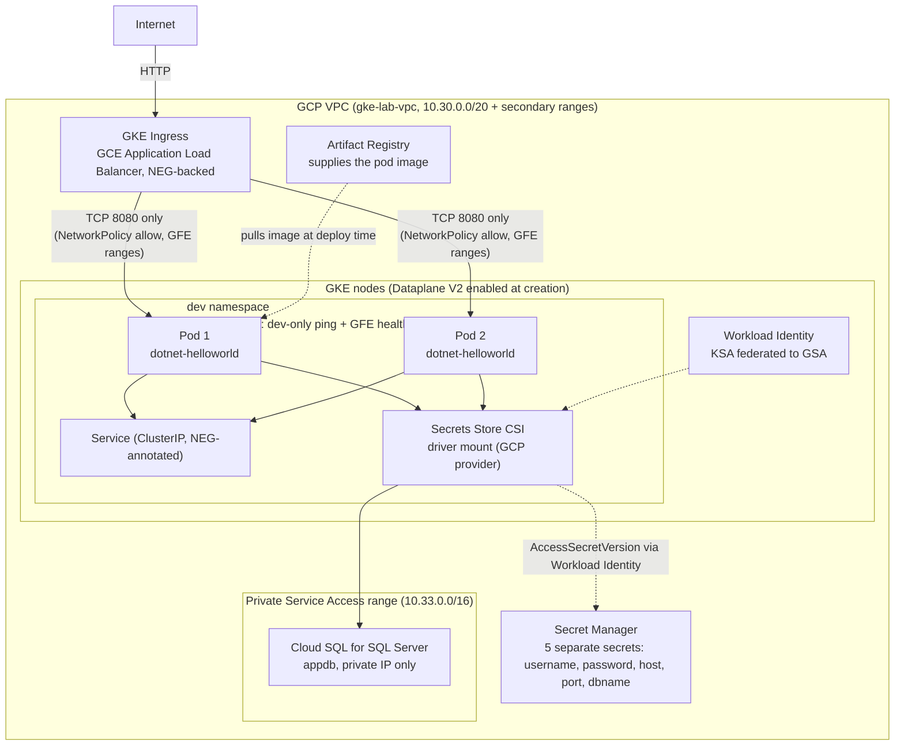

# GKE + Cloud SQL Lab — Setup Guide

This is the GCP/GKE equivalent of the AKS and EKS labs, covering the same
six requirements with GCP-native primitives:

| AKS lab | EKS lab | GKE lab |
|---|---|---|
| AKS | EKS | GKE (Dataplane V2 + Workload Identity enabled at creation) |
| ACR | ECR | Artifact Registry |
| Azure Key Vault | AWS Secrets Manager | GCP Secret Manager |
| Azure SQL + Private Endpoint | RDS SQL Server, private subnet + SG | Cloud SQL for SQL Server, private IP via Private Service Access |
| Azure AD Workload Identity | IRSA | Workload Identity Federation for GKE |
| `--network-policy azure` (built-in) | Disabled by default after a real incident; works on retest with fresh nodes - see the EKS lab's README | GKE Dataplane V2 (built into the cluster from creation, not a retrofit) |
| AGIC | AWS Load Balancer Controller + ALB | GKE Ingress (GCE Ingress Controller, built into GKE - no separate install) |

## Architecture — what's actually deployed



## Quickest path: one script

```bash
chmod +x run-all.sh
./run-all.sh
```

Expect ~25-35 minutes total — Cloud SQL provisioning is the slowest single
step (10-15 minutes), the GKE cluster itself another 5-10. Unlike the EKS
lab, there's no manual pause for database creation — Cloud SQL's
`gcloud sql databases create` works the way Azure SQL's `az sql db create`
does, so this script handles it automatically.

## Prerequisites

Run `install-tools.sh` first if you don't already have `gcloud`,
`kubectl`, `helm`, `jq`, and `docker` installed:

```bash
chmod +x install-tools.sh
./install-tools.sh
# log out and back in (or: newgrp docker && source ~/.bashrc)
gcloud auth login          # or: gcloud auth login --no-launch-browser on headless machines
gcloud config set project <your-project-id>
```

## Apply order (manual, if not using run-all.sh)

### 1. GCP infrastructure
```bash
./00-gcp-infra.sh
```
Creates the VPC and subnet (with secondary ranges for GKE pods/services),
the GKE cluster (Dataplane V2 and Workload Identity Federation both
enabled at creation time, not added afterward), Artifact Registry, the
Private Service Access peering needed for Cloud SQL's private IP, the
Cloud SQL for SQL Server instance itself (private IP only, no public IP),
the application database, and 5 separate Secret Manager secrets holding
the connection credentials.

### 2. Workload Identity Federation, Secrets Store CSI driver
```bash
./01-gke-identity-and-sql.sh
```
Creates a GCP service account (GSA), grants it read access to all 5 SQL
secrets, binds the Kubernetes ServiceAccount (KSA) to impersonate it via
Workload Identity Federation, and installs the Secrets Store CSI driver +
GCP provider plugin. No GKE Ingress controller install and no NetworkPolicy
engine install happen here — see "Why GKE needs less setup" below for why.

### 3. Fill in placeholders
| Placeholder | Where | Source |
|---|---|---|
| `<GSA-EMAIL>` | 01 | printed by `01-gke-identity-and-sql.sh` / `.infra-state.env` |
| `<PROJECT_ID>` | 02 | `.infra-state.env` |
| `<AR_URI>` | 04, build-and-push.sh | `.infra-state.env` |
| `<GCP_REGION>` | build-and-push.sh | `.infra-state.env` |

`run-all.sh` auto-fills all of these — there's no equivalent to the AKS
lab's App Gateway subnet CIDR or the EKS lab's ALB subnet CIDR placeholder
that can't be known until after the load balancer exists, since GKE's
NetworkPolicy allowance uses GCP's fixed, published health-check IP
ranges (`35.191.0.0/16` and `130.211.0.0/22`) instead of a
dynamically-assigned subnet.

### 4. Build, push, apply
```bash
./build-and-push.sh
kubectl apply -f k8s/dev/00-namespace.yaml
kubectl apply -f k8s/dev/01-serviceaccount.yaml
kubectl apply -f k8s/dev/02-secretproviderclass.yaml
kubectl apply -f k8s/dev/03-configmap.yaml
kubectl apply -f k8s/dev/04-deployment-service.yaml
kubectl apply -f k8s/dev/05-networkpolicy.yaml
kubectl apply -f k8s/dev/07-ingress-gke.yaml
```

### 5. Verify DB connectivity
```bash
kubectl get pods -n dev
kubectl logs -n dev deploy/dotnet-helloworld
kubectl exec -n dev deploy/dotnet-helloworld -- env | grep SQL_
```
For a definitive, code-independent connectivity check (the app's default
route may not actually query the database):
```bash
kubectl run nettest --rm -it --restart=Never -n dev --image=busybox -- \
  nc -zv <cloud-sql-private-ip> 1433
```

### 6. Verify ping/NetworkPolicy behavior
```bash
kubectl apply -f k8s/dev/06-network-test-pods.yaml
DEV_IP=$(kubectl get pod -n dev net-test-dev -o jsonpath='{.status.podIP}')
kubectl exec -n dev net-test-dev -- ping -c 3 "$DEV_IP"        # should succeed
kubectl exec -n other-ns net-test-other -- ping -c 3 "$DEV_IP" # should fail/time out
```
Unlike the EKS lab, NetworkPolicy enforcement here is **on from cluster
creation** (Dataplane V2), so this test should be meaningful immediately —
no separate enable step, no "this currently won't show real enforcement"
caveat.

### 7. Verify GKE Ingress
```bash
kubectl get ingress -n dev   # can take 5-10 minutes for ADDRESS to populate -
                              # GKE Ingress provisions a global external
                              # Application Load Balancer, which is
                              # genuinely slower to come up than AGIC or ALB
curl -v http://<ADDRESS-from-above>/
```

### 8. Rotate the SQL password later
```bash
./rotate-sql-password.sh
```

## Why GKE needs less setup than AKS or EKS for this lab

Two things that needed separate install steps and careful handling on the
other two clouds are built into GKE from cluster creation here:

**NetworkPolicy enforcement.** AKS gets this via a single
`--network-policy azure` flag. EKS needed a completely separate add-on
(Calico, or VPC CNI's native mode) installed *after* the cluster and its
default networking were already running — and on the EKS lab, enabling
either of those caused a real, severe, reproducible cluster-wide outage
that took node replacement to recover from (full details in the EKS lab's
README). GKE's Dataplane V2, enabled with `--enable-dataplane-v2` at
`gcloud container clusters create` time in `00-gcp-infra.sh`, has
NetworkPolicy enforcement built into the data path from the very first
moment the cluster exists — there is no "retrofit this onto an
already-running CNI" step at all, which is structurally the class of risk
that caused the EKS incident. This doesn't guarantee Dataplane V2 has zero
risk of its own, but it avoids that specific risk pattern entirely.

**External ingress.** AGIC and the AWS Load Balancer Controller both need
a separate controller installed into the cluster (Helm charts, IAM
roles, IRSA/Workload-Identity bindings) before any Ingress object does
anything. GKE's Ingress controller (the GCE Ingress Controller) is part
of GKE itself — applying `k8s/dev/07-ingress-gke.yaml` is the entire setup
needed; there's no controller to install first.

## A genuine GKE-specific requirement: ClusterIP + NEG annotation, not NodePort

The Service backing the GKE Ingress (`k8s/dev/04-deployment-service.yaml`)
uses `type: ClusterIP` with an explicit
`cloud.google.com/neg: '{"ingress": true}'` annotation, not `NodePort`.
GCP's own documentation recommends `ClusterIP` with NEGs (container-native
load balancing) over `NodePort`, since `NodePort` requires two extra
network hops (load balancer → node → kube-proxy → pod) that NEGs skip
entirely by letting the load balancer talk to pod IPs directly.

The annotation is added explicitly here rather than relying on GKE's
usual auto-annotation behavior, because that auto-annotation is
documented to **not** apply when GKE Network Policy is in use — which
this lab's Dataplane V2 setup counts as. Without the explicit annotation,
the Ingress would silently fall back to a less efficient, NEG-less path.

## Health checks and NetworkPolicy — GKE's version of a real bug found twice already

Both the AKS lab and the EKS lab hit the same shape of bug: a
NetworkPolicy scoped to allow traffic only from the `dev` namespace
silently blocks the load balancer's health probes too, since that traffic
is genuinely external to the namespace from the policy's perspective —
even though it looks like it should be covered by "allow traffic to my
app." `k8s/dev/05-networkpolicy.yaml` includes the fix from the start: an
explicit second ingress rule allowing GCP's published health-check source
ranges (`35.191.0.0/16`, `130.211.0.0/22`) through on the app's port only.

GKE's version of this is actually easier to get right than AKS's or EKS's:
those clouds' equivalent CIDR is either a single dedicated subnet decided
at infra-creation time (AKS, known upfront) or a dynamically-assigned
subnet you can't know until the load balancer already exists (EKS,
requiring a "deploy first, narrow later" placeholder). GCP's health-check
ranges are fixed, documented, global values that never change regardless
of region, project, or load balancer configuration — so this lab's
NetworkPolicy needed no placeholder and no "narrow this down later" step
at all.

## Tearing everything down

```bash
./cleanup.sh
```

Like the EKS lab (and unlike the AKS lab's single `az group delete`), GCP
has no single command that deletes everything created by this lab at
once. `cleanup.sh` deletes resources in dependency order: the Ingress
first (to let GKE deprovision the load balancer/NEGs/health checks
cleanly), then Cloud SQL, Secret Manager secrets, Artifact Registry, the
workload identity GSA, the GKE cluster, the Private Service Access peering
connection (which can only be removed after Cloud SQL is gone, since the
instance holds an IP from that peered range), and finally the firewall
rule, subnet, and VPC. This is genuinely destructive and asks for
confirmation unless you pass `--yes`.

One GCP-specific risk worth knowing: if the Ingress is deleted *after* the
GKE cluster is gone (rather than before, as `cleanup.sh` does), the load
balancer and its NEGs/health checks become orphaned and need manual
cleanup from the Cloud Console — there's no cluster left to tell GCP to
deprovision them. `cleanup.sh` deliberately deletes the Ingress first and
waits 60 seconds before going further, specifically to avoid this.
